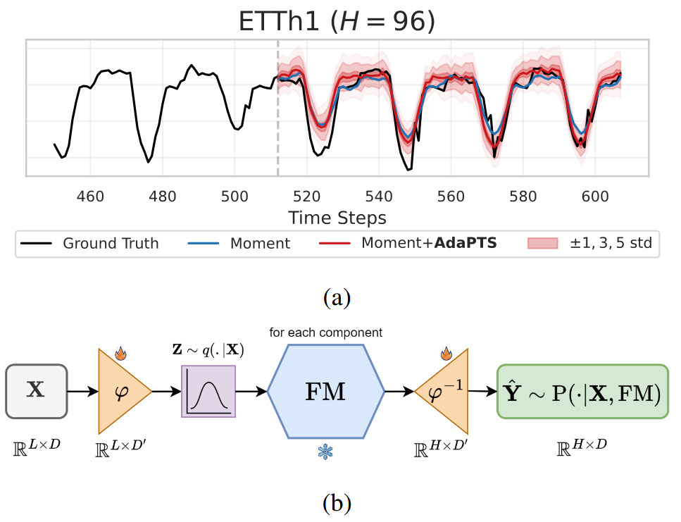
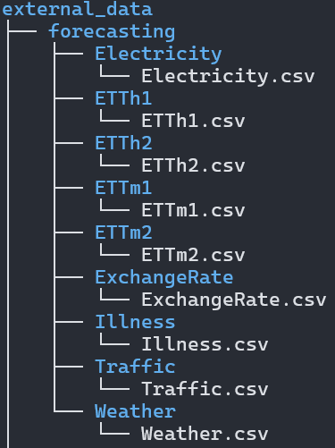

# AdaPTS: Adapting Univariate Foundation Models to Probabilistic Multivariate Time Series Forecasting

## 🎯 Overview
This repository contains the official implementation of the paper:

   >Abdelhakim Benechehab, Vasilii Feofanov, Giuseppe Paolo, Albert Thomas, Maurizio Filippone, Balázs Kégl.
   [AdaPTS: Adapting Univariate Foundation Models to Probabilistic Multivariate Time Series Forecasting](https://arxiv.org/pdf/2402.10198).

### 📝 Abstract:
Pre-trained foundation models (FMs) have shown exceptional performance in univariate time series forecasting tasks. However, several practical challenges persist, including managing intricate dependencies among features and quantifying uncertainty in predictions. This study aims to tackle these critical limitations by introducing \textbf{adapters}—feature-space transformations that facilitate the effective use of pre-trained univariate time series FMs for multivariate tasks. Adapters operate by projecting multivariate inputs into a suitable latent space and applying the FM independently to each dimension \rebuttal{\st{in a zero-shot manner}}. Inspired by the literature on representation learning and partially stochastic Bayesian neural networks, we present a range of adapters and optimization/inference strategies. Experiments conducted on both synthetic and real-world datasets confirm the efficacy of adapters, demonstrating substantial enhancements in forecasting accuracy and uncertainty quantification compared to baseline methods. Our framework, \textbf{AdaPTS}, positions adapters as a modular, scalable, and effective solution for leveraging time series FMs in multivariate contexts, thereby promoting their wider adoption in real-world applications.




## 📁 Directory structure
An overview of the repository's structure and contents (inside `/src/adapts/`):

- `adapts.py`: Main file containing the main class **ADAPTS** that orchestrates the framework.
- `adapters.py`: Contains the implementation of different adapters.
- `icl/`: Contains the `ICLTrainer` class, which defines an interface with Time series Foundation Models. An child class is then defined for each family of foundation models, e.g. `MomentICLTrainer` and `MoiraiICLTrainer`.
- `utils/`: Helper functions and classes.


## 🚀 Installation

- create a conda environment:
```
conda create -n adapts python=3.10
```
- activate the environment:
```
conda activate adapts
```
- Install the package
```
pip install .
```
- to run the **hyperopt** script, install the optional dependencies
```
pip install .[hyperopt]
```
- to use **Moment**, install the corresponding repository
```
pip install git+https://github.com/moment-timeseries-foundation-model/moment.git
```
- to use **Moirai**, install the corresponding repository
```
pip install git+https://github.com/SalesforceAIResearch/uni2ts.git
```
- for developers, install the optional dependencies
```
pip install -e .[dev]
pre-commit install
```

## 🏃 Getting started

### 🏁 The getting started notebook: `notebooks/getting_started.ipynb`

### 🔄 Main script: `run.py`
With the main script you can run a foundation model of your choice, using the adapter of your choice, on the task of your choice (dataset, context length, and forecasting horizon).

- Here is an example command using **Moment** (the supervision mode supported for Moment is `--supervised "ft_then_supervised"` because we need to first fine-tune the linear forecasting head):
```
python run.py --forecast_horizon 24 --model_name "AutonLab/MOMENT-1-small" --context_length 512 --seed $RANDOM --device "cuda:0" --dataset_name "Illness" --adapter "linearlVAE" --use_revin --supervised "ft_then_supervised"
```

- Here is an example command using **Moirai** (the supervision mode supported for Moirai is `--supervised "True"` because it forecasts in a zero-shot manner):
```
python run.py --forecast_horizon 96 --model_name "Salesforce/moirai-1.1-R-small" --context_length 512 --seed $RANDOM --device "cuda:0" --dataset_name "ETTh1" --adapter "VAE" --use_revin --supervised "True"
```

- Here is the list of all the command options, that you can access by running `python run.py --help`:


- The datasets should be available following this format from root location (Illness is provided as an example):



### 🔍 Hyperparameter optimization: `hyperopt.py`
Use this command to search for the best hyperparameters of a given adapter. You can customize the hyperparameter search spaces in the `get_search_space` function of the `hyperopt.py` file.

- Here is an example:

```
python hyperopt.py --seed=$RANDOM --forecasting_horizon=96 --dataset_name="ExchangeRate" --adapter="VAE" --gpu_fraction_per_worker=1.0 --num_samples=50
```

The hyperparameter search uses **Ray-Tune** with the **HEBO** engine.

- Here is the list of all the command options, that you can access by running `python hyperopt.py --help`:


## 📋 List of supported Adapters

| Adapter | Class Name | Dim Reduction | Dim Expansion | Probabilistic | Hyperparameters |
|---------|------------|---------------|---------------|---------------|-----------------|
| Identity | IdentityTransformer | ❌ | ❌ | ❌ | - |
| PCA | MultichannelProjector(PCA) | ✅ | ❌ | ❌ | - |
| SVD | MultichannelProjector(TruncatedSVD) | ✅ | ❌ | ❌ | - |
| Random Projection | MultichannelProjector(SparseRandomProjection) | ✅ | ❌ | ❌ | - |
| Linear AE | LinearAutoEncoder | ✅ | ✅ | ❌ | - |
| Linear Decoder | LinearDecoder | ❌ | ❌ | ❌ | - |
| Linear Encoder | LinearEncoder | ❌ | ❌ | ❌ | - |
| Dropout Linear AE | DropoutLinearAutoEncoder | ✅ | ✅ | ✅ | dropout_rate (p) |
| Linear VAE | betaLinearVAE | ✅ | ✅ | ✅ | beta |
| Linear lVAE | linearLikelihoodVAE | ✅ | ✅ | ✅ | beta, fixed_logvar |
| Simple AE | SimpleAutoEncoder | ✅ | ✅ | ❌ | hidden_dim, num_layers |
| VAE | betaVAE | ✅ | ✅ | ✅ | hidden_dim, num_layers, beta |
| lVAE | likelihoodVAE | ✅ | ✅ | ✅ | hidden_dim, num_layers, beta, fixed_logvar |
| Flow | NormalizingFlow | ❌ | ❌ | ❌ | hidden_dim, num_coupling |
| AE Flow | AENormalizingFlow | ✅ | ✅ | ✅ | hidden_dim, num_coupling, dropout_rate |
| RevIN | JustRevIn | ❌ | ❌ | ❌ | - |

## 📋 List of supported Time series Foundation Models

| Foundation Model | Handles Multivariate | Probabilistic | Sizes | Paper | Code | HuggingFace |
|-----------------|---------------------|---------------|--------|-------|------|-------------|
| MOMENT | ❌ | ❌ | small, medium, large | [Paper](https://arxiv.org/abs/2308.08723) | [GitHub](https://github.com/moment-timeseries-foundation-model/moment) | [AutonLab/MOMENT](https://huggingface.co/AutonLab/MOMENT) |
| MOIRAI | ⚠️ (flatten+attention bias) | ✅ | small, medium, large | [Paper](https://arxiv.org/abs/2402.01801) | [GitHub](https://github.com/SalesforceAIResearch/uni2ts) | [Salesforce/moirai](https://huggingface.co/Salesforce/moirai) |

## ⚖️ License

This project is licensed under the MIT License. See the [LICENSE](LICENSE) file for more details.

## 🤝 Open-source Participation

Do not hesitate to contribute to this project by submitting pull requests or issues, we would be happy to receive feedback and integrate your suggestions.

---
